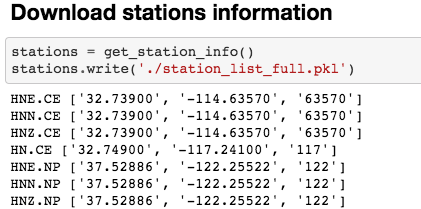
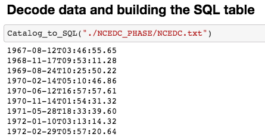
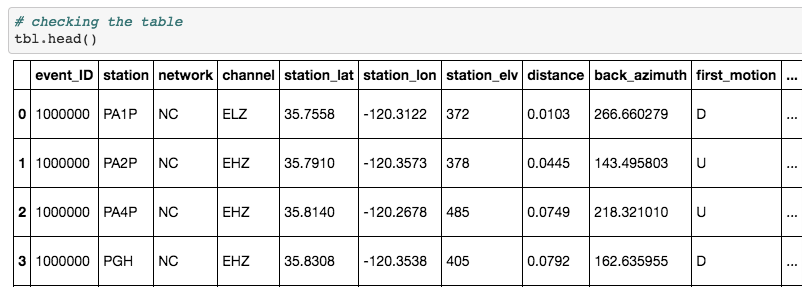
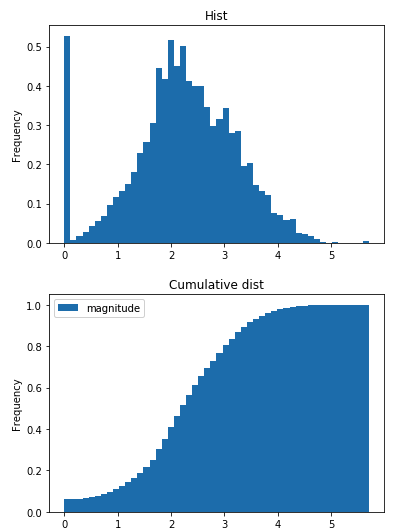
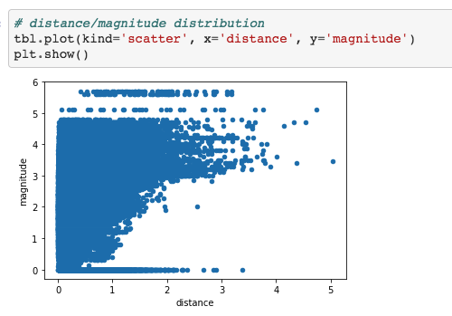

# seismic metadata preparation (with application to North California Earthquake Data Center)

This code search and download metadata for siesmic phases and associated station information. 
Then it decode the hypoinverse format and write it as a SQL database. 
The database will next be used to match with waveform data. 
The database can easily be converted to Panda dataframe for exploring the data. 

# See the notebook for instructions

